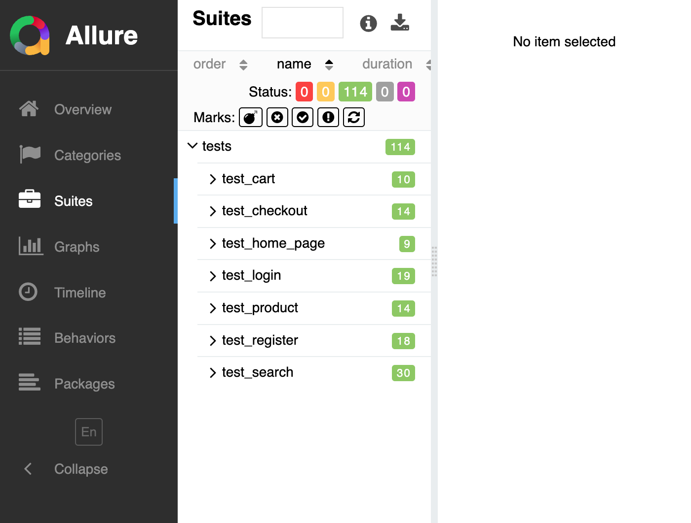

# OpenCart E-Commerce Test Automation Framework

A production-grade QA automation framework for the **OpenCart 4.0** e-commerce platform, built with **Playwright** and **Python**. Demonstrates real-world test engineering practices including Page Object Model architecture, data-driven testing, and CI/CD integration.

---

## Test Results

**114 tests | 100% pass rate | 7 test suites | ~7 min execution time**

### Allure Report Overview


### Test Suites Breakdown



| Test Suite | Tests | Coverage |
|------------|:-----:|----------|
| **Cart** | 10 | Add to cart, view cart, update quantity, remove, header widget |
| **Checkout** | 14 | Page template, guest form validation, coupon code, gift certificate |
| **Home Page** | 9 | Navbar, carousel slider, featured products section |
| **Login** | 19 | Form visibility, data-driven valid/invalid credentials |
| **Product** | 14 | Template structure, featured products integrity, server response validation |
| **Register** | 18 | Form visibility, data-driven registration scenarios |
| **Search** | 30 | Form elements, data-driven keyword search, result interactions |

---

## Key Features

- **Page Object Model (POM)** -- 8 page classes with base inheritance for clean, maintainable test architecture
- **Data-Driven Testing** -- CSV-based parametrized tests for comprehensive scenario coverage
- **Server Response Validation** -- Intercepts HTML responses to verify server-rendered data matches UI
- **Coupon & Gift Certificate Testing** -- Validates discount application and error handling via AJAX forms
- **Template-First Strategy** -- Tests verify structural integrity (template) rather than every content variation
- **Trace on Failure** -- Automatic Playwright trace capture and screenshots when tests fail
- **Multi-Browser Support** -- Tests run across Chromium, Firefox, and WebKit
- **CI/CD Pipeline** -- GitHub Actions workflow with browser matrix and artifact uploads
- **Allure Reporting** -- Rich test reports with suite breakdown, timeline, and trend analysis
- **Dockerized Environment** -- One-command OpenCart setup with Docker Compose

---

## Tech Stack

| Tool | Purpose |
|------|---------|
| Python 3.11+ | Programming language |
| Playwright | Browser automation framework |
| Pytest | Test framework with markers and parametrization |
| Allure | Test reporting with rich dashboards |
| Docker | Containerized OpenCart + MySQL environment |
| OpenCart 4.0 | Application under test |
| GitHub Actions | CI/CD pipeline with browser matrix |

---

## Project Structure

```
opencart-automation-using-playwright/
├── conftest.py                     # Pytest fixtures, trace-on-failure, browser config
├── pytest.ini                      # Pytest config, markers, Allure integration
├── requirements.txt                # Python dependencies
├── docker-compose.yml              # Docker setup (OpenCart + MySQL)
├── .env.example                    # Environment variable template
│
├── pages/                          # Page Object Model classes
│   ├── base_page.py                #   Base class with common actions
│   ├── home_page.py                #   Home page (navbar, slider, featured)
│   ├── search_page.py              #   Search results page
│   ├── product_page.py             #   Product detail page
│   ├── cart_page.py                #   Shopping cart page
│   ├── checkout_page.py            #   Checkout + coupon/gift forms
│   ├── login_page.py               #   User login page
│   └── register_page.py            #   User registration page
│
├── tests/                          # Test suites (114 tests)
│   ├── test_home_page.py           #   Home page template tests (9)
│   ├── test_search.py              #   Search functionality (30)
│   ├── test_product.py             #   Product page + server response (14)
│   ├── test_cart.py                #   Shopping cart flows (10)
│   ├── test_checkout.py            #   Checkout + coupon/gift (14)
│   ├── test_login.py               #   Login/logout data-driven (19)
│   └── test_register.py            #   Registration data-driven (18)
│
├── testdata/                       # CSV test data files
│   ├── search_data.csv             #   15 search keyword combinations
│   ├── product_data.csv            #   4 featured product datasets
│   ├── cart_data.csv               #   2 cart-eligible products
│   ├── checkout_data.csv           #   5 guest checkout scenarios
│   ├── login_data.csv              #   8 login credential combos
│   └── register_data.csv           #   10 registration scenarios
│
├── runners/                        # Test execution scripts
│   ├── run_all.py                  #   Run complete suite
│   ├── run_smoke.py                #   Smoke tests only
│   ├── run_regression.py           #   Full regression
│   └── ...                         #   Per-module runners
│
├── utilities/
│   ├── csv_reader.py               # CSV data loader utility
│   └── test_data.py                # Static test data
│
├── docs/                           # Documentation assets
│   ├── allure-overview.png         #   Allure report screenshot
│   └── allure-suites.png           #   Allure suites screenshot
│
└── .github/workflows/
    └── test.yml                    # CI/CD pipeline (GitHub Actions)
```

---

## Test Architecture

### Testing Strategy

This framework follows a **template-first testing strategy**:

> *"Test the template, not the content."*
> If the MacBook product page works, the iPhone page likely works too -- they use the same code. The exception: Featured Products are tested specifically to verify the database query isn't broken.

This approach reduces test count from hundreds of redundant checks to a focused, maintainable suite:

- **Template tests** validate page structure with one representative product
- **Data-driven tests** verify the same flow with different input combinations
- **Integrity tests** ensure database queries return the correct products
- **Server response tests** intercept HTTP responses to cross-validate UI vs backend

### Page Object Model

```
BasePage (common actions: click, fill, navigate, get_text)
    ├── HomePage       (navbar, slider, featured products)
    ├── SearchPage     (search form, results, filters)
    ├── ProductPage    (product info, images, tabs, add-to-cart)
    ├── CartPage       (cart table, quantity, totals, AJAX updates)
    ├── CheckoutPage   (guest form, validation, coupon/gift codes)
    ├── LoginPage      (credentials form, error handling)
    └── RegisterPage   (registration form, validation)
```

### Data-Driven Testing

Test data is externalized in CSV files, enabling non-technical team members to add scenarios:

```csv
test_id,firstname,lastname,email,address_1,city,postcode,country,zone,expected_result
checkout_valid_guest,John,Doe,john.doe@test.com,123 Test St,New York,10001,United States,New York,success
checkout_missing_firstname,,Doe,jane@test.com,456 Elm Ave,Chicago,60601,United States,Illinois,error
```

---

## Getting Started

### Prerequisites

- **Python 3.11+**
- **Docker Desktop** (running)
- **Git**

### 1. Clone & Set Up

```bash
git clone https://github.com/Maisha-Chowa/opencart-automation-using-playwright.git
cd opencart-automation-using-playwright

python3 -m venv venv
source venv/bin/activate          # macOS/Linux
pip install -r requirements.txt
playwright install
```

### 2. Start OpenCart

```bash
docker compose up -d
```

Complete the installation:

```bash
curl -sL -X POST "http://localhost/install/index.php?route=install/step_3&language=en-gb" \
  -d "db_driver=mysqli&db_hostname=database&db_username=root&db_password=opencart_password&db_database=opencart&db_prefix=oc_&db_port=3306&username=admin&password=admin123&email=admin@example.com"

docker exec opencart-app rm -rf /var/www/html/install
```

Verify: open http://localhost in your browser.

### 3. Run Tests

```bash
# Run all 114 tests
pytest

# Run by marker
pytest -m smoke          # Critical path tests
pytest -m regression     # Full regression suite
pytest -m cart           # Cart tests only
pytest -m checkout       # Checkout tests only
pytest -m search         # Search tests only

# Run a specific suite
pytest tests/test_checkout.py
pytest tests/test_cart.py

# Multi-browser
pytest --browser firefox
pytest --browser webkit

# Headed mode (visible browser)
pytest --headed
pytest --headed --slowmo 500
```

### 4. Generate Allure Report

```bash
# Tests automatically write to allure-results/ via pytest.ini
pytest

# View the report
allure serve allure-results

# Or generate a static report
allure generate allure-results --clean -o allure-report
```

---

## Test Artifacts on Failure

When a test fails, the framework automatically captures:

| Artifact | Location | Description |
|----------|----------|-------------|
| Screenshot | `screenshots/*.png` | Full-page screenshot at point of failure |
| Trace | `traces/*.zip` | Playwright trace with timeline, DOM, network |

Open a trace file:

```bash
playwright show-trace traces/<test_name>.zip
```

---

## CI/CD Pipeline

The GitHub Actions workflow (`.github/workflows/test.yml`) runs on every push and PR:

1. Spins up OpenCart via Docker Compose
2. Installs Python + Playwright browsers
3. Runs tests across **Chromium, Firefox, and WebKit** (matrix strategy)
4. Uploads Allure results, screenshots, and traces as artifacts

---

## Docker Commands

```bash
docker compose up -d          # Start containers
docker compose down           # Stop containers
docker compose down -v        # Stop and wipe all data
docker compose ps             # Check container status
docker compose logs -f        # View live logs
```

---

## Default Credentials

| Role | Username | Password |
|------|----------|----------|
| Admin | admin | admin123 |

---

## Skills Demonstrated

| Skill | Implementation |
|-------|---------------|
| Page Object Model | 8 page classes with base inheritance in `pages/` |
| Data-Driven Testing | 6 CSV files driving 44+ parametrized scenarios |
| Server Response Validation | HTTP response interception in `test_product.py` |
| AJAX Handling | Cart update/remove waits for specific AJAX responses |
| Coupon & Gift Testing | Accordion forms with valid/invalid code validation |
| Template-First Strategy | Focused tests that avoid redundant content checks |
| Multi-Browser Testing | Chromium, Firefox, WebKit via `--browser` flag + CI matrix |
| Trace on Failure | `conftest.py` hook saves traces and screenshots automatically |
| CI/CD Pipeline | GitHub Actions with Docker + 3-browser matrix |
| Allure Reporting | Rich dashboards with suite breakdown and pass/fail metrics |
| Negative Testing | Invalid inputs, empty states, missing fields, XSS/SQL injection strings |
| Clean Architecture | Fixtures, helpers, CSV data separation, strict markers |
